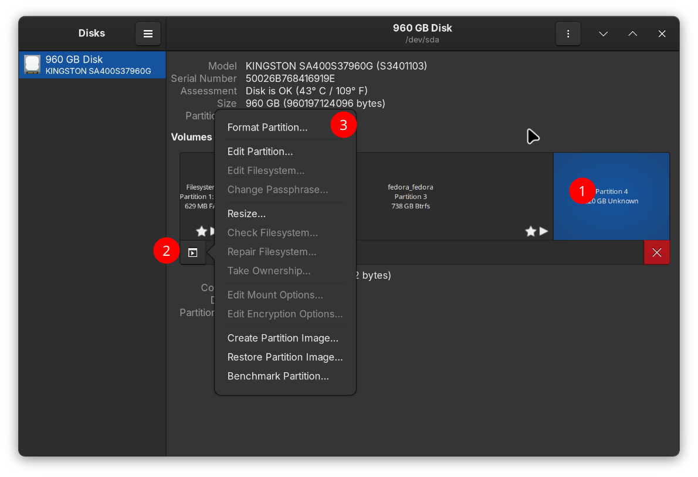
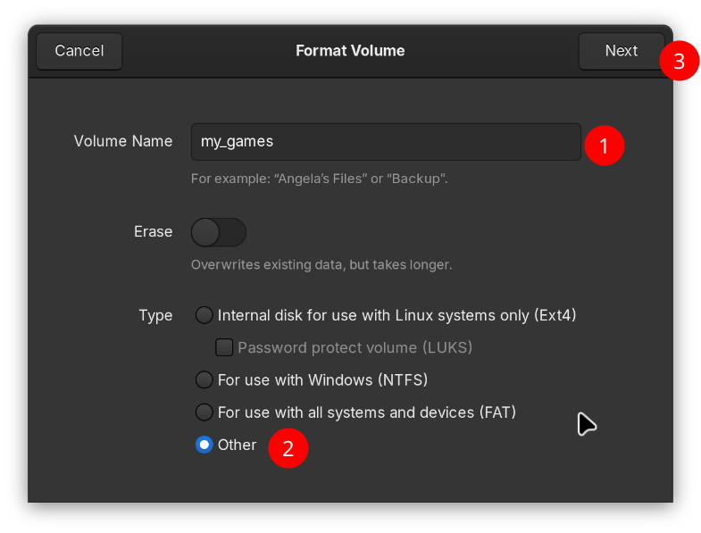
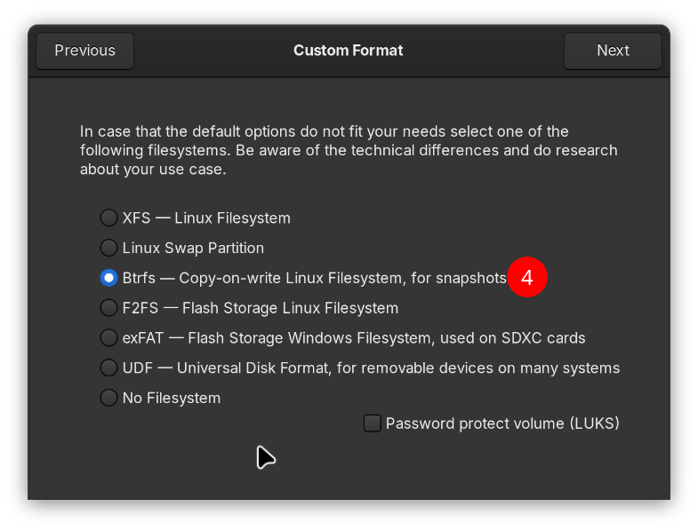
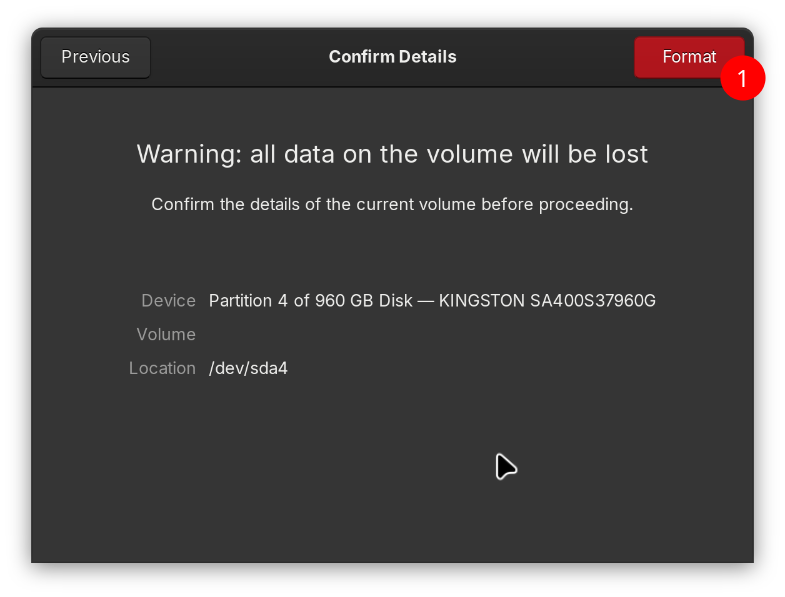
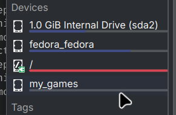

---
authors:
  - "@nicknamenamenick"
  - "@HikariKnight"
  - "@asen23"
  - "@TheScreechingBagel"
  - "@Zeglius"
tags:
  - Guide
---

<!-- ANCHOR: METADATA -->
<!--{"url_discourse": "https://universal-blue.discourse.group/docs?topic=970", "fetched_at": "2024-09-03 16:43:14.005694+00:00"}-->
<!-- ANCHOR_END: METADATA -->

!!! info "MicroSD cards automatically mount without any manual intervention required on Bazzite."

## Setup an auto-mounting partition

1. Open Gnome Disks, should have an icon like this. 

2. Wipe the partition you want to use, then use the leftover to create a new one.

   

3. Give it a name and a filesystem.

!!! warning "We only support BTRFS/ext4 filesystems"

{data-gallery="step-2"}
{data-gallery="step-2"}
{data-gallery="step-2"}

Now reboot, your partition should be mounted automatically. Should appear under `/run/media/system/PARTITION_NAME`.

{data-gallery="step-3"}

## Emergency Mode After Mounting?

This video tutorial shows how to recover from your mounting mistakes.

https://www.youtube.com/watch?v=-2wca_0CpXY
