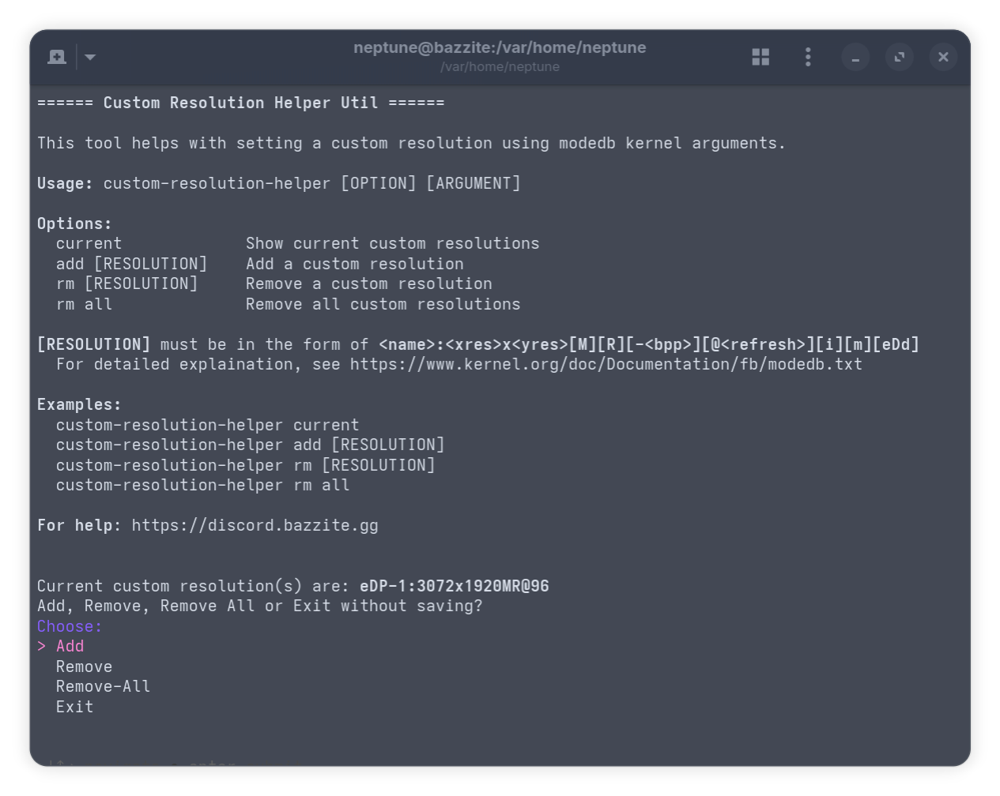

# `custom-resolution-helper`



!!! warning "Remove any custom resolutions if you encounter an unexpected display issue with `crh rm all`. Any modifications to your device should be done appropriately **at your own risk**"

!!! info "Custom resolutions created with this method require a reboot to take effect."

A command-line utility that assists with **creating** and **managing** custom resolutions for your Bazzite installation.

## Using `custom-resolution-helper`


Open a host terminal and **enter**:

```command
custom-resolution-helper
```

There is also an **alias** which is less typing for those on handhelds or HTPC setups without a keyboard:

```command
crh
```

### Options Available:

- `current`: Show your current resolutions, if any.
- `add`: Add a custom resolution.
- `rm`: Remove a custom resolution.
- `rm all`: Remove all custom resolutions.
- Run without arguments for **Interactive Mode**

### Guide for creating a custom resolution

1. Run `custom-resolution-helper` in a terminal.
2. Verify that you do **not** have a duplicate resolution.
3. Choose `Add`, using arrow keys to navigate and enter to submit.
4. Select the Display you want to create a custom resolution for. This display should be `connected`.
5. Follow the Instructions on-screen in **Interactive Mode**.
6. Once you finished selecting the options, you will get a prompt to change the boot configuration. Simply authorize it with your password.
7. Once the command finishes, you can reboot and select the new resolution in your **System Settings**.

#### Interactive Mode Option Explaination:

- **VESA(TM) Coordinated Video Timings(CVT)**: Select this if your refresh rate is not currently selectable in **System Settings** (e.g. you are overclocking your display from 60Hz to 75Hz, but 75Hz is currently not an available refresh rate).

- **Reduced Blanking**: You will want this if your monitor has a high resolution or refresh rate. You can check [Tom Verbeure's display timing calculator](https://tomverbeure.github.io/video_timings_calculator) to learn more.

- **Interlaced**: This sets the resolution as interlaced, useful for something like a Plasma TV or CRT Display.

- **Margins**: This is useful when the margins of the picture are hidden beyond the borders of the screen, as if the picture is zoomed in. Most of the time you would want this to be adjusted in the Monitor/TV instead.


### Guide for creating a custom resolution for Sunshine Game Streaming

Let's say you are streaming from your host PC (running Bazzite) to your Laptop:

- Your host PC has a resolution of `1920x1080@144Hz`,
- but your Laptop has a resolution of `2560x1600@120Hz`.

...and text in the stream looks blurry because of resolution scaling.

You can use `custom-resolution-helper` to add a virtual display to your host PC (running Bazzite) without a dummy plug!

- Simply follow the steps for creating a custom resolution, and select the option to make the display **always enabled**. After rebooting, you can press <kbd>Super</kbd> + <kbd>P</kbd> to switch multi-monitor modes on KDE. After that, make sure the correct display is selected in Sunshine.

- Alternatively, you can also add a `2560x1600MR@120` mode to your host PC's main display. This may cause your host PC's monitor to black out and show an `unsupported mode` dialog, and you will have to change the resolution during game streaming. You can try this method if you don't want to deal with multiple monitors.

!!! info "Using DisplayPort for virtual displays is recommended, as custom resolutions on HDMI ports may require an additional `edid` file, which this tool does not support."

!!! warning "Do **not** disable the main display, as doing that may leave you with no available display out (which may also break streaming). <br>If you do encounter a black screen that persists after rebooting, you can try going into a `tty` by pressing <kbd>ctrl</kbd> + <kbd>alt</kbd> + <kbd>F2</kbd>, and edit or remove `~/.config/kwinoutputconfig.json` from the command line. Note that this will remove your monitor configurations. <br>An example command will be `mv ~/.config/kwinoutputconfig.json ~/.config/kwinoutputconfig.json.bak`"

### Advanced Usage

This tool adds a **kernel argument** with `video=[RESOLUTION]`. The `[RESOLUTION]` string follows the format `<name>:<xres>x<yres>[M][R][-<bpp>][@<refresh>][i][m][eDd]`, as specified in the [kernel documentation for modedb](https://www.kernel.org/doc/Documentation/fb/modedb.txt).

If you feel confident enough and know what you are doing, you can use the

```command
custom-resolution-helper add [RESOLUTION]
```

to add a resolution with functionality not included in this script, such as forcing a DVI-I port to use digital output.

