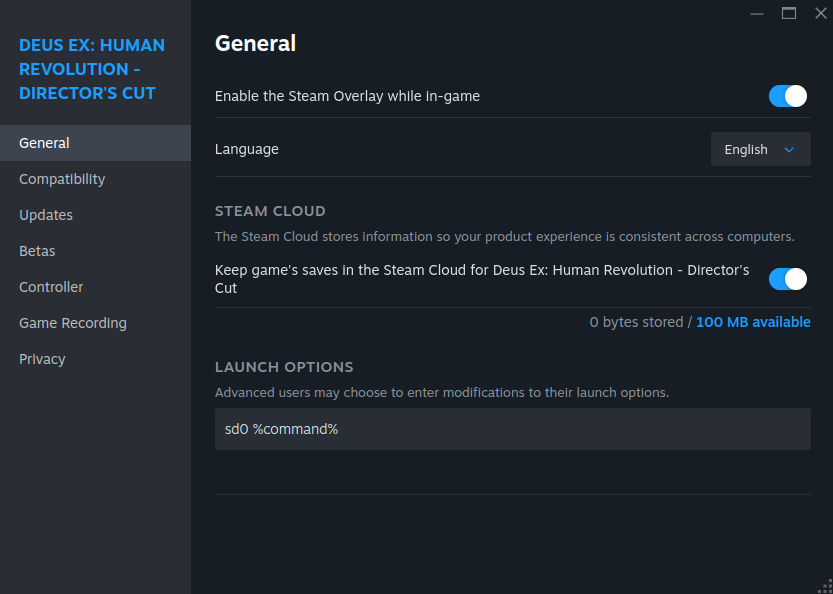

---
authors:
  - "@nicknamenamenick"
  - "@termdisc"
tags:
  - Guide
---

<!-- ANCHOR: METADATA -->
<!--{"url_discourse": "https://universal-blue.discourse.group/docs?topic=2656", "fetched_at": "2024-09-03 16:43:09.533219+00:00"}-->
<!-- ANCHOR_END: METADATA -->

## **Steam Setup**

Steam can run Windows games on Linux. It utilizes a wide range of projects and patches all packed into a piece of software built-in to Steam called [Proton](https://github.com/ValveSoftware/Proton) for Windows compatibility.

### Forcing A Specific Proton / Steam Play Tool Version

!!! warning 
    
    Games that use Denuvo Anti-Tamper DRM consider changing Proton versions as activiating the game on different hardware which may cause you to get locked out of the game if you change the Proton version more than 5 times within a 24 hour period.

- Games with a Linux port will be used by default on Desktop images.
- Valve selects the default runner on _Handheld/HTPC_ images.
- Some games run better with a specific version of Proton or forcing the Linux runtime.
  - Run that specific version by going into the game's **Properties** > **Compatibility** > **Force the use of a specific Steam Play compatibility tool**
##### Image Example


### Steam Launch Options and Shortcuts

Steam launch options allow you to pass environment variables, arguments, and commands to games when they start. Bazzite includes several shortcuts and UX improvements to make common launch options easier to use, especially on handheld devices.

#### Common Launch Option Patterns

Most Steam launch options follow this pattern: `ENVIRONMENT_VARIABLES command_or_script %command%`

- `%command%` represents the game executable and must be included
- Environment variables go before `%command%`
- Additional arguments can go after `%command%`

**Examples:**
```
PROTON_LOG=1 %command%                    # Enable Proton logging
SteamDeck=0 %command%                     # Disable Steam Deck mode
PROTON_ENABLE_NGX_UPDATER=1 %command%     # Enable DLSS updates
```

#### Bazzite's Launch Option Shortcuts

Bazzite includes several shortcuts to simplify common launch options:

##### For Steam Deck Mode Control
- **`sd0 %command%`** - Shorthand for `SteamDeck=0 %command%`
  - Disables Steam Deck specific features that may conflict with your setup
  - Useful when keyboard/mouse doesn't work or game launchers don't appear
  - Available via the `sd0` script

##### For NVIDIA Users (dlss-swapper)
- **`dlss-swapper %command%`** - Enables latest DLSS presets with NGX updater
  - Replaces: `PROTON_ENABLE_NGX_UPDATER=1 DXVK_NVAPI_DRS_SETTINGS=NGX_DLSS_SR_OVERRIDE=on,NGX_DLSS_RR_OVERRIDE=on,NGX_DLSS_FG_OVERRIDE=on,NGX_DLSS_SR_OVERRIDE_RENDER_PRESET_SELECTION=render_preset_latest,NGX_DLSS_RR_OVERRIDE_RENDER_PRESET_SELECTION=render_preset_latest %command%`
- **`dlss-swapper-dll %command%`** - Same as above but skips NGX updater

#### Handheld UX Improvements

On Bazzite handheld images (-deck), additional UX improvements help reduce virtual keyboard typing:

- **Auto-clipboard**: ` %command%` is automatically copied to clipboard when Steam launches

**Example handheld workflow:**
1. Open game properties → Launch Options
2. Type: `sd0`
3. Press the virtual keyboard's paste button to add ` %command%`
4. Result: `sd0 %command%`

> To the game, `sd0 %command%` is the same as launching with `SteamDeck=0 [game path]`, setting `SteamDeck` to `0` to help with compatibility issues.

#### Where to Set Launch Options

1. Right-click game in Steam library
2. Select **Properties**
3. In the General tab, find **Launch Options** field
4. Enter your launch options




#### Advanced Launch Option Management

For users who need more complex launch option management, consider:

- **[ScopeBuddy](../Advanced/scopebuddy.md)** - Advanced gamescope launch option management

## **Non-Steam Games**

**It is recommended to use [Lutris](https://lutris.net/games?q=&ordering=-popularity&paginate_by=100) for _most_ non-steam games**.  There are edge cases with specific launchers and games that have a better working alternative than Lutris, but Lutris is the most supported option for PC games outside of Steam on Bazzite outside of special scenarios.

### Lutris

Lutris offers two methods to play Windows games on Bazzite.  Community-driven scripts or manually adding the executable.  It is **highly recommended to use the manual method** as some scripts are poorly maintained.

#### Lutris Installer Scripts


Lutris is game management software that doubles as a WINE front-end for Windows games. Several games and launchers can be installed by searching for the title and using one of the installer scripts for it.

#### Manually adding a Windows game to Lutris


However if your game is not listed or doesn't work with the provided script, then manually add the executable. It will need a [**prefix directory**](/Gaming/Managing_and_modding_games.md#non-steam-games-prefix-management) created somewhere, but by default it will use the `~/Games` directory for each game.


#### Lutris Shortcuts


Right clicking a game on Lutris gives the option to add it as a non-Steam game (useful for Steam Gaming Mode), create a desktop shortcut, or an application menu shortcut.

### Epic Games, GOG, and Amazon Games Launcher

[**Heroic Games Launcher**](https://flathub.org/apps/com.heroicgameslauncher.hgl) is recommended for games that were purchased from Epic Games Launcher, GOG, and Amazon Games Launcher.

### Game Pass and Microsoft Store Games (Xbox Cloud Gaming)

!!! note
    
    A Game Pass Ultimate subscription is required to use [Xbox Cloud Gaming](https://www.xbox.com/en-us/play) except for select games like Fortnite.

Games installed from the Microsoft Store do **not** run unless you use a Xbox Cloud Gaming client like [**Greenlight**](https://github.com/unknownskl/greenlight). Fortnite can also be played via this method **without** a Game Pass subscription.

<hr>

[**<-- Back to Gaming Guide**](./index.md)
