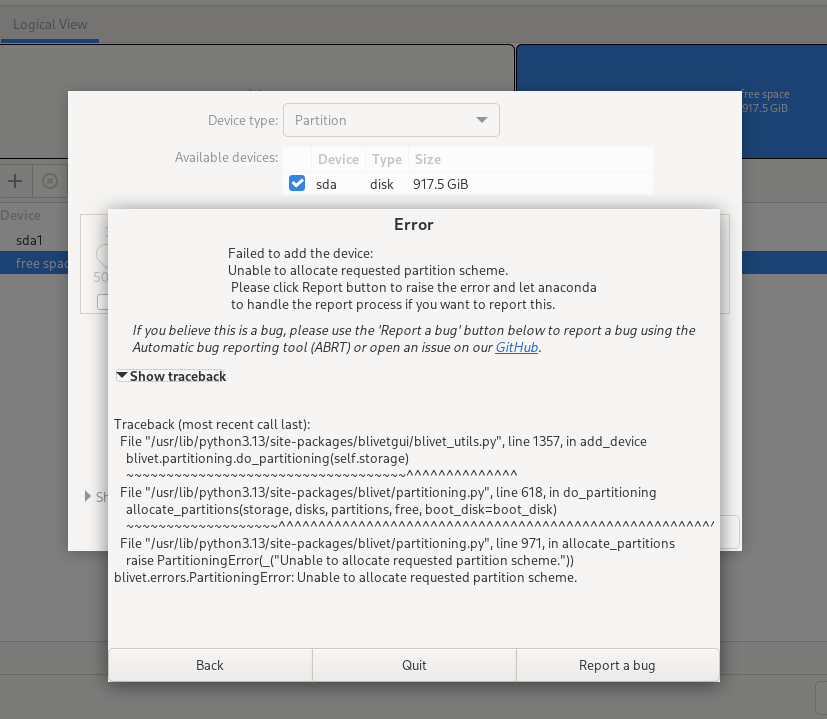

---
authors:
  - "@nicknamenamenick"
---

<!-- ANCHOR: METADATA -->
<!--{"url_discourse": "https://universal-blue.discourse.group/docs?topic=2495", "fetched_at": "2024-09-03 16:43:22.238775+00:00"}-->
<!-- ANCHOR_END: METADATA -->

## Error Code 1

A generic error may appear during installation.

**Watch this video for a workaround**:
https://www.youtube.com/watch?v=GRdz08hJByo

## "Device is Active" Error

**Watch this video for a workaround**:

https://www.youtube.com/watch?v=FBGLLkIKp-w

## "Error checking storage configuration"

**Watch this video for a workaround**:

https://www.youtube.com/watch?v=VTnm9EiBdPA

## "Bad shim signature, you need to load the kernel first" error

**Watch this video for a workaround**:

https://www.youtube.com/watch?v=Z_DsWqTuipU

>[**Secure Boot Guide**](/General/Installation_Guide/secure_boot.md)

## Unable to allocate requested partition scheme error

This error occurs when installing on drives larger than 2TB where the first 2TB or more is already occupied by one or more partitions. The image below illustrates the error message.

It seems like the Anaconda installer cannot create any paritions after the 2TB mark.

Here are some possible solutions on how you can address it:

- Install Bazzite on a different storage device where Bazzite can have the entire drive.
- If you're dual booting with Windows, reduce the size of your Windows partition to under 2TB. If Windows' Disk Management can't do this, consider using a third-party tool like [EaseUS Partition Master](https://www.easeus.com/partition-master/) to resize the partitions while Windows is not running.
- If the drive contains no important data, you can delete all existing partitions and restart the installation process.

## Alternative Installation Method

!!! note

    **The alternative installation method is useful for downloading a smaller ISO and may resolve issues with downloading Bazzite's ISO, but contains installer display issues on most handheld hardware**.

If none of the above errors are relevant to your issue, or you still have problems installing Bazzite, then try following our alternative installation method:

[**Try installing Bazzite by rebasing from Fedora Kinoite (KDE Plasma) or Fedora Silverblue (GNOME)**](/General/Installation_Guide/alternate-install-guide.md).
